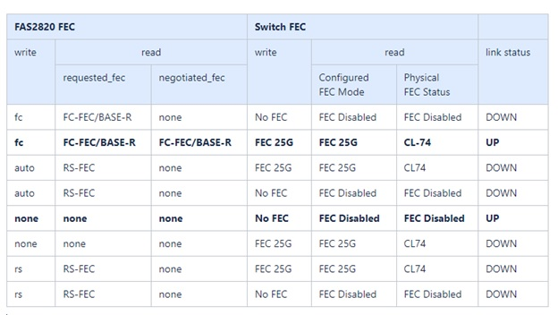

= ケーブル接続と構成に関する考慮事項を確認
:allow-uri-read: 
:icons: font
:imagesdir: ../media/

[role="lead"]
Broadcom BES-53248スイッチを設定する前に、次の考慮事項を確認してください。

== クラスタポートスイッチの割り当て

Broadcom対応BES-53248クラスタスイッチポート割り当てテーブルを参考にして、クラスタを設定できます。

|===

| *スイッチポート* | *ポートの使用状況* 

 a| 
0 ~ 16
 a| 
10 / 25GbEクラスタポートノード、基本設定

 a| 
17-48
 a| 
10 / 25GbEクラスタポートノード、ライセンスあり

 a| 
49-54
 a| 
40 / 100GbEクラスタポートノード（ライセンスあり）を右から左に追加

 a| 
55～56
 a| 
100GbE クラスタスイッチ間リンク（ ISL ）ポート、基本設定

|===
を参照してください https://hwu.netapp.com/Switch/Index["Hardware Universe"^] スイッチポートの詳細については、を参照してください。

== ポートグループの速度制限

* BES-53248クラスタスイッチでは、48個の10 / 25GbE（SFP28 / SFP+）ポートが12個の4ポートグループに結合されます。ポート1~4、5 ~ 8、9 ~ 12、13 ~ 16、17 ~ 20、21～24、25～28、29～32、33～36、37～40、41-44および45-48。
* SFP28 / SFP+ ポート速度は、 4 ポートグループのすべてのポートで同じ（ 10GbE または 25GbE ）でなければなりません。
* 4ポートグループの速度が異なると、スイッチポートは正常に動作しません。

== FECノヨウケン

* 銅線ケーブルを使用した25Gポートの詳細については、次の表を参照してください。
+
コントローラ側が `auto`スイッチ側はFEC 25Gに設定されています。

+
image::../media/FEC_copper_table.jpg[25Gポートと銅線ケーブル]

* 25Gポートと光ファイバケーブルの詳細については、次の表を参照してください。
+

=== Bootargノシツソウ

次のコマンドを使用して、25GポートFECを次のいずれかに設定します。 `auto` または `fc`（必要に応じて）：

[listing]
----
systemshell -node <node> -command sudo sysctl dev.ice.<X>.requested_fec=<auto/fc>
----
* に設定すると *`auto`*：
+
** 。 `auto` を設定すると、設定がすぐにハードウェアに伝播され、再起動は必要ありません。
** 状況 `bootarg.cpk_fec_fc_eXx already exists`を選択すると、bootargストレージから削除されます。
** リブート後、 `auto` 設定は次の日付以降維持されます： `auto` は、デフォルトのFEC設定です。

* に設定すると *`fc`*：
+
** 。 `FC-FEC` を設定すると、設定がすぐにハードウェアに伝播され、リブートは不要です。
** 新しい `bootarg.cpk_fec_fc_eXx` は、値を「true」に設定して作成されます。
** リブート後、 `FC-FEC` ドライバコードが使用できるように設定が維持されます。

