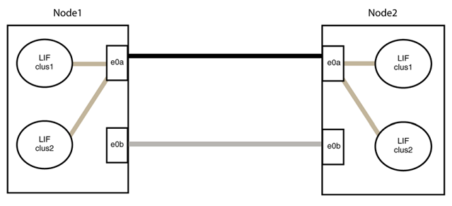

= Broadcom BES-53248クラスタスイッチをスイッチレス接続に交換します
:allow-uri-read: 
:icons: font
:imagesdir: ../media/

[role="lead"]
ONTAP 9.3以降では、スイッチクラスタネットワークを使用するクラスタから2つのノードが直接接続されたクラスタに移行できます。

== 要件を確認

.ガイドライン
次のガイドラインを確認してください。

* 2ノードスイッチレスクラスタ構成への移行は無停止で実行できます。ほとんどのシステムでは、各ノードに2つの専用クラスタインターコネクトポートがありますが、4、6、8など、各ノードに多数の専用クラスタインターコネクトポートがあるシステムでもこの手順 を使用できます。
* 3ノード以上のスイッチレスクラスタインターコネクト機能は使用できません。
* クラスタインターコネクトスイッチを使用する既存の2ノードクラスタがONTAP 9.3以降を実行している場合は、スイッチをノード間の直接のバックツーバック接続に交換できます。

.必要なもの
* クラスタスイッチで接続された2つのノードで構成された正常なクラスタ。ノードで同じONTAP リリースが実行されている必要があります。
* 各ノードに必要な数の専用クラスタポートが装備され、システム構成に対応するための冗長なクラスタインターコネクト接続が提供されます。たとえば、1つのシステムに2つの冗長ポートがあり、各ノードに2つの専用クラスタインターコネクトポートがあるとします。

== スイッチを移行します

.このタスクについて
次の手順 は、2ノードクラスタ内のクラスタスイッチを削除し、スイッチへの各接続をパートナーノードへの直接接続に置き換えます。

image::../media/tnsc_clusterswitches_and_direct_connections.PNG[クラスタスイッチを直接接続に置き換えます]

.例について
次の手順 の例は、「e0a」と「e0b」をクラスタポートとして使用しているノードを示しています。システムによって異なるクラスタポートがノードによって使用されている場合があります。

=== 手順1：移行の準備

. 権限レベルを advanced に変更します。続行するかどうかを尋ねられたら、「 y 」と入力します。
+
「 advanced 」の権限が必要です

+
アドバンス・プロンプトが表示されます

. ONTAP 9.3以降では、スイッチレスクラスタの自動検出がサポートされます。このクラスタはデフォルトで有効になっています。
+
スイッチレスクラスタの検出が有効になっていることを確認するには、advanced権限のコマンドを実行します。

+
「network options detect-switchless -cluster show」を参照してください

+
.例を示します
[%collapsible]
====
オプションが有効になっている場合の出力例を次に示します。

[listing]
----
cluster::*> network options detect-switchless-cluster show
   (network options detect-switchless-cluster show)
Enable Switchless Cluster Detection: true
----
====
+
「Enable Switchless Cluster Detection」がの場合 `false`ネットアップサポートにお問い合わせください。

. このクラスタで AutoSupport が有効になっている場合は、 AutoSupport メッセージを呼び出してケースの自動作成を抑制します。
+
「system node AutoSupport invoke -node *-type all -message MAINT=<number_OF_hours >」の形式で指定します

+
ここで'h'は'メンテナンス時間の長さを時間単位で表したものですこのメンテナンスタスクについてテクニカルサポートに通知し、メンテナンス時間中にケースの自動作成を停止できるようにします。

+
次の例は、ケースの自動作成を2時間停止します。

+
.例を示します
[%collapsible]
====
[listing]
----
cluster::*> system node autosupport invoke -node * -type all -message MAINT=2h
----
====

=== 手順2：ポートとケーブルを設定する

. グループ1のクラスタポートがクラスタスイッチ1に、グループ2のクラスタポートがクラスタスイッチ2になるように、各スイッチのクラスタポートをグループにまとめます。これらのグループは、手順 の後半で必要になります。
. クラスタポートを特定し、リンクのステータスと健全性を確認します。
+
「 network port show -ipspace cluster 」のように表示されます

+
次の例では、クラスタポート「e0a」と「e0b」を持つノードについて、1つのグループは「node1：e0a」と「node2：e0a」、もう1つのグループは「node1：e0b」と「node2：e0b」と識別されます。使用するクラスタポートはシステムによって異なるため、ノードによって異なるクラスタポートが使用されている場合があります。

+
image::../media/tnsc_clusterswitch_connections.PNG[ノード1とノード2の間のクラスタスイッチ接続]

+
ポートの値がになっていることを確認します `up` をクリックします `healthy` をクリックします。

+
.例を示します
[%collapsible]
====
[listing]
----
cluster::> network port show -ipspace Cluster
Node: node1
                                                                 Ignore
                                             Speed(Mbps) Health  Health
Port  IPspace   Broadcast Domain Link  MTU   Admin/Oper	 Status  Status
----- --------- ---------------- ----- ----- ----------- ------- -------
e0a   Cluster   Cluster          up    9000  auto/10000  healthy false
e0b   Cluster   Cluster          up    9000  auto/10000  healthy false

Node: node2
                                                                 Ignore
                                             Speed(Mbps) Health  Health
Port  IPspace   Broadcast Domain Link  MTU   Admin/Oper	 Status  Status
----- --------- ---------------- ----- ----- ----------- ------- -------
e0a   Cluster   Cluster          up    9000  auto/10000  healthy false
e0b   Cluster   Cluster          up    9000  auto/10000  healthy false
4 entries were displayed.
----
====
. すべてのクラスタLIFがそれぞれのホームポートにあることを確認します。
+
各クラスタLIFの「is-home」列が「true」になっていることを確認します。

+
network interface show -vserver Cluster -fields is-fehome」というコマンドを入力します

+
.例を示します
[%collapsible]
====
[listing]
----
cluster::*> net int show -vserver Cluster -fields is-home
(network interface show)
vserver  lif          is-home
-------- ------------ --------
Cluster  node1_clus1  true
Cluster  node1_clus2  true
Cluster  node2_clus1  true
Cluster  node2_clus2  true
4 entries were displayed.
----
====
+
ホームポートにないクラスタLIFがある場合は、それらのLIFをホームポートにリバートします。

+
network interface revert -vserver Cluster -lif *

. クラスタLIFの自動リバートを無効にします。
+
network interface modify -vserver Cluster -lif *-auto-revert false

. 前の手順で確認したすべてのポートがネットワークスイッチに接続されていることを確認します。
+
「network device-discovery show -port_cluster_port_」というコマンドを実行します

+
[Discovered Device]列には、ポートが接続されているクラスタスイッチの名前を指定します。

+
.例を示します
[%collapsible]
====
次の例は、クラスタポート「e0a」と「e0b」がクラスタスイッチ「cs1」と「cs2」に正しく接続されていることを示しています。

[listing]
----
cluster::> network device-discovery show -port e0a|e0b
  (network device-discovery show)
Node/     Local  Discovered
Protocol  Port   Device (LLDP: ChassisID)  Interface  Platform
--------- ------ ------------------------- ---------- ----------
node1/cdp
          e0a    cs1                       0/11       BES-53248
          e0b    cs2                       0/12       BES-53248
node2/cdp
          e0a    cs1                       0/9        BES-53248
          e0b    cs2                       0/9        BES-53248
4 entries were displayed.
----
====
. クラスタの接続を確認します。
+
「 cluster ping-cluster -node local 」を参照してください

. クラスタが正常であることを確認します。
+
「 cluster ring show 」を参照してください

+
すべてのユニットはマスタまたはセカンダリのいずれかでなければなりません。

. グループ1のポートにスイッチレス構成を設定します。
+

IMPORTANT: ネットワークの潜在的な問題を回避するには、group1からポートを切断し、できるだけ速やかに元に戻します。たとえば、20秒未満の*の場合は、「*」のようにします。

+
.. group1内のポートからすべてのケーブルを同時に外します。
+
次の例では、各ノードのポート「e0a」からケーブルが切断され、クラスタトラフィックがスイッチとポート「e0b」を経由して各ノードで続行されています。

+
image::../media/tnsc_clusterswitch1_disconnected.PNG[ClusterSwitch1が切断された]

.. group1内のポートを背面にケーブル接続します。
+
次の例では、node1の「e0a」がnode2の「e0a」に接続されています。

+
image::../media/tnsc_ports_e0a_direct_connection.PNG[ポート「e0a」間の直接接続]

. スイッチレス・クラスタ・ネットワーク・オプションは'false'からtrue'に移行しますこの処理には最大45秒かかることがあります。スイッチレス・オプションが「true」に設定されていることを確認します。
+
network options switchless-cluster show

+
次の例は、スイッチレスクラスタを有効にします。

+
[listing]
----
cluster::*> network options switchless-cluster show
Enable Switchless Cluster: true
----
. クラスタネットワークが中断しないことを確認します。
+
「 cluster ping-cluster -node local 」を参照してください

+

IMPORTANT: 次の手順に進む前に、少なくとも2分待ってグループ1でバックツーバック接続が機能していることを確認する必要があります。

. グループ2のポートにスイッチレス構成を設定します。
+

IMPORTANT: ネットワークの潜在的な問題を回避するには、ポートをgroup2から切断して、できるだけ速やかに元に戻す必要があります。たとえば、20秒以内に*と入力します。

+
.. group2のポートからすべてのケーブルを同時に外します。
+
次の例では、各ノードのポート「e0b」からケーブルが切断され、クラスタトラフィックは「e0a」ポート間の直接接続を経由して続行されます。

+
image::../media/tnsc_clusterswitch2_disconnected.PNG[クラスタスイッチ2が切断されました]

.. group2のポートを背面にケーブル接続します。
+
次の例では、node1の「e0a」がnode2の「e0a」に接続され、node1の「e0b」がnode2の「e0b」に接続されています。

+

=== 手順3：構成を確認します

. 両方のノードのポートが正しく接続されていることを確認します。
+
「network device-discovery show -port_cluster_port_」というコマンドを実行します

+
.例を示します
[%collapsible]
====
次の例は、クラスタポート「e0a」と「e0b」がクラスタパートナーの対応するポートに正しく接続されていることを示しています。

[listing]
----
cluster::> net device-discovery show -port e0a|e0b
  (network device-discovery show)
Node/      Local  Discovered
Protocol   Port   Device (LLDP: ChassisID)  Interface  Platform
---------- ------ ------------------------- ---------- ----------
node1/cdp
           e0a    node2                     e0a        AFF-A300
           e0b    node2                     e0b        AFF-A300
node1/lldp
           e0a    node2 (00:a0:98:da:16:44) e0a        -
           e0b    node2 (00:a0:98:da:16:44) e0b        -
node2/cdp
           e0a    node1                     e0a        AFF-A300
           e0b    node1                     e0b        AFF-A300
node2/lldp
           e0a    node1 (00:a0:98:da:87:49) e0a        -
           e0b    node1 (00:a0:98:da:87:49) e0b        -
8 entries were displayed.
----
====
. クラスタLIFの自動リバートを再度有効にします。
+
network interface modify -vserver Cluster -lif *-auto-revert trueを指定します

. すべてのLIFがホームにあることを確認する。これには数秒かかることがあります。
+
network interface show -vserver Cluster -lif LIF_nameです

+
.例を示します
[%collapsible]
====
次の例では、「Is Home」列が「true」の場合、LIFはリバートされています。

[listing]
----
cluster::> network interface show -vserver Cluster -fields curr-port,is-home
vserver  lif           curr-port is-home
-------- ------------- --------- -------
Cluster  node1_clus1   e0a       true
Cluster  node1_clus2   e0b       true
Cluster  node2_clus1   e0a       true
Cluster  node2_clus2   e0b       true
4 entries were displayed.
----
====
+
いずれかのクラスタLIFがホームポートに戻っていない場合は、手動でリバートします。

+
「network interface revert -vserver Cluster -lif LIF_name」のようになります

. いずれかのノードのシステムコンソールで、ノードのクラスタステータスを確認します。
+
「 cluster show 」を参照してください

+
.例を示します
[%collapsible]
====
次の例では'両方のノードのイプシロンをfalseに設定しています

[listing]
----
Node  Health  Eligibility Epsilon
----- ------- ----------- --------
node1 true    true        false
node2 true    true        false
2 entries were displayed.
----
====
. クラスタポート間の接続を確認します。
+
「cluster ping-cluster local」と入力します

. ケースの自動作成を抑制した場合は、 AutoSupport メッセージを呼び出して作成を再度有効にします。
+
「 system node AutoSupport invoke -node * -type all -message MAINT= end 」というメッセージが表示されます

+
詳細については、を参照してください link:https://kb.netapp.com/Advice_and_Troubleshooting/Data_Storage_Software/ONTAP_OS/How_to_suppress_automatic_case_creation_during_scheduled_maintenance_windows_-_ONTAP_9["ネットアップの技術情報アーティクル 1010449 ：「 How to suppress automatic case creation during scheduled maintenance windows"^]。

. 権限レベルを admin に戻します。
+
「特権管理者」

